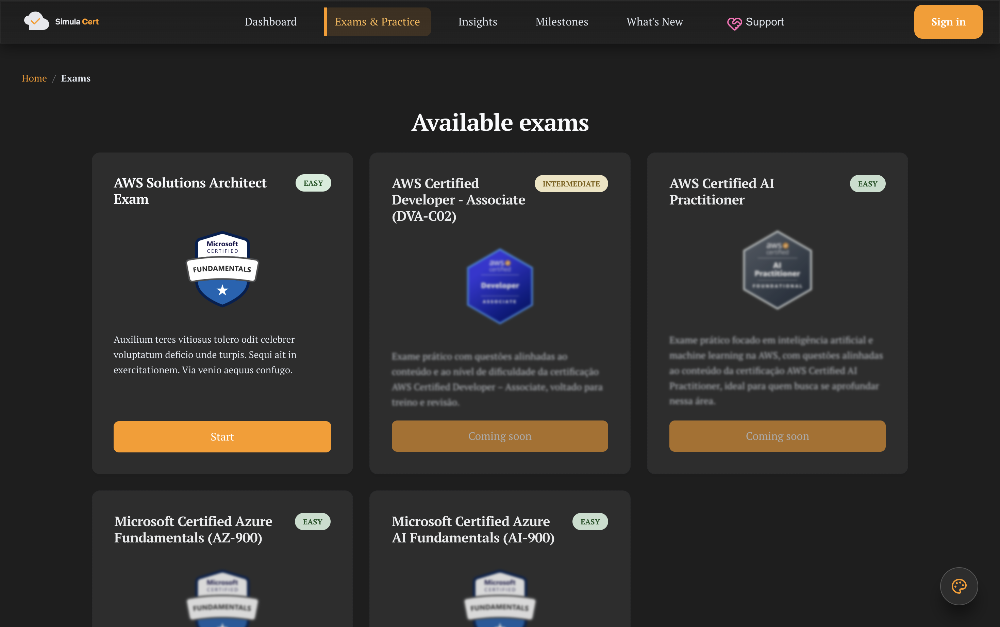

# SimulaCert

## Idiomas da documentação / Documentation languages

[](https://github.com/m-feliciano/app.simulacert/actions/workflows/deploy.yml)

- 🇺🇸 English: see [README.en.md](./README.en.md)

## Sobre a Plataforma

SimulaCert é uma **plataforma 100% gratuita** para simulados de certificações tecnológicas, como AWS, Azure e Google Cloud. Nossa missão é ajudar profissionais a se prepararem para exames de certificação com simulados realistas, explicações detalhadas e ferramentas de análise de desempenho.

> Experimente agora: [Acesse SimulaCert](https://simulacert.com)



## Destaques

- **Simulados Atualizados**: Questões no formato dos exames reais.
- **Explicações Detalhadas**: Entenda cada resposta com explicações claras.
- **Estatísticas de Desempenho**: Acompanhe seu progresso e identifique áreas de melhoria.
- **Acessibilidade**: Interface responsiva e inclusiva.
- **Internacionalização**: Suporte a múltiplos idiomas.
- **Gratuito**: Todos os recursos essenciais estão disponíveis sem custo.

## Documentação da API

A documentação da API está disponível em [docs/api](https://tinyurl.com/2s4kp83e).

## Rodando localmente (desenvolvimento)

Pré-requisitos: Node.js (LTS recomendado) e npm.

```bash
npm install
npm run start
```

Outros comandos úteis:

```bash
npm test
npm run build
```

### Mockoon
Para testar a API localmente, recomendamos usar o [Mockoon](https://mockoon.com/). Ele permite criar e gerenciar APIs simuladas de forma fácil e rápida, ideal para desenvolvimento e testes.
Use o arquivo `mockoon.json` para importar os endpoints da API.

## Internacionalização (i18n)
O aplicativo está atualmente disponível em inglês e português. Para adicionar mais idiomas, siga estes passos:
1. Crie um novo arquivo JSON no diretório `src/assets/i18n` (ex: `es.json` para espanhol).
2. Adicione os pares de chave-valor traduzidos ao novo arquivo JSON.
3. Atualize o componente de personalização para adicionar a nova opção de idioma.

## Contribuindo

Contribuições são bem-vindas! Veja [CONTRIBUTING.md](./CONTRIBUTING.md) para detalhes sobre como ajudar no desenvolvimento do SimulaCert.

## Licença

Este projeto está sob uma licença proprietária. Consulte o arquivo [LICENSE](./LICENSE) para mais detalhes.

## Contato

- **Website**: [simulacert.com](https://simulacert.com)
- **E-mail**: marcelofeliciano@tutamail.com

Última atualização: 2026-05-28
